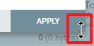

# nifi-processor-config-resizer

문서작성시 properties 화면을 capture 할 일이 많은데 창이 작아서 capture 가 한 화면에 안되어 자잘한 작업이 많아지는 이유로 개발하게 되었음

# Known Issue

알 수 없는 이유로 사이즈 조절시 바로 안그려지긴 하지만 다른 항목 클릭 등의 어떤 액션 취해주면 제대로 그려짐

# Usage

원래는 아래처럼 사이즈가 고정되어 조절이 불가능함

APPLY 버튼 우측 아래에 마우스를 가져다 대면 위아래로 크기 조절이 가능해짐

자세한 사진

크기 증가한 모습

# Chrome Extension publish

[Chrome Web Store Developer Dashboard](https://chrome.google.com/webstore/devconsole)

가입 후 각종 정보를 입력

2022-04-01 에 등록하여 검토 대기 중이었다가 2022-04-04 에 게시되었음

게시되면 메일로 알려줌

개발자 dashboard 에서 확인한 모습

# Installation

[chrome 웹 스토어](https://chrome.google.com/webstore/category/extensions) 에서 `nifiextension` 검색

extension 선택

Chrome에 추가

확장 프로그램 추가

# References

* https://developer.chrome.com/docs/extensions/mv3/getstarted/
* https://support.google.com/chrome/a/answer/2714278?hl=ko
* https://chrome.google.com/webstore/devconsole
